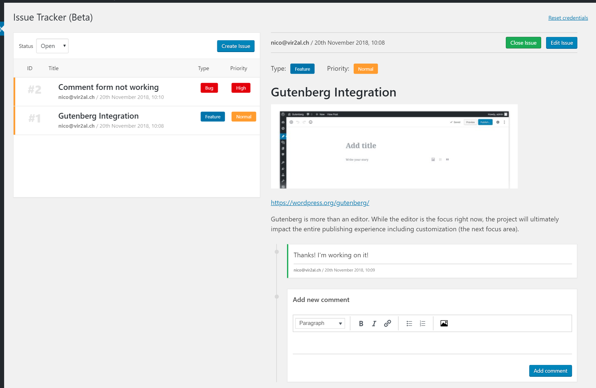

Hello Issue Tracker
======================
**A WordPress plugin that connects your admin interface with your GitLab Issue System**



If you manage your or your clients WordPress website over GitLab you already have a very powerful ticketing system. But it's quite hard to use for non developers. That's why "Hello Issue Tracker" closes the gap!

"Hello Issue Tracker" provides an interface, where any WordPress admin can create, read, edit and comment GitLab issues! Awesome, right?  
It also provides a fully featured WYSIWYG editor that even allows image uploads and has a label-abstraction that gives you a better overview over the type, the priority and the author of an issue.

_This plugin is in an open beta version and not yet in the plugin directory._

## Set-up
* Download an install the plugin
* Navigate to the Issue Tracker Admin Page
* Insert the URL to your GitLab repository
* Insert you [Private Token ](https://docs.gitlab.com/ee/user/profile/personal_access_tokens.html)
* Save the settings and let the magic happen

## Developers

### Hooks

**Filter `hit_priorities`**

Add or remove priorities.

````php
function mytheme_hit_priorities( $priorities ) {
	/*
	Default value:
	$priorities = array(
		'low'    => 'Low',
		'normal' => 'Normal',
		'high'   => 'High',
	);
	*/
	
	$priorities[ 'immediately' ] = 'Immediately'; // Ex. adds an even higher priority
	return $priorities;
}
add_filter( 'hit_priorities', 'mytheme_hit_priorities' );
````

**Filter `hit_types`**

Add or remove issue-types.

````php
function mytheme_hit_types( $types ) {
	/*
	Default value:
	$types = array(
		'low'    => 'Low',
		'normal' => 'Normal',
		'high'   => 'High',
	);
	*/
	
	$types[ 'support' ] = 'Support request'; // Ex. adds a support issue type
	return $types;
}
add_filter( 'hit_types', 'mytheme_hit_types' );
````

**Filter `hit_label_prefix`**

"Hello Issue Tracker" adds a prefix to identify things like the author, the type or the priority of an issue or comment. By default it's `wp_`. But it can easily be changed by using this filter.

````php
function mytheme_hit_label_prefix( $prefix ) {
	return 'myprefix_';
}
add_filter( 'hit_label_prefix', 'mytheme_hit_label_prefix' );
````

## What about GitHub or Bitbucket?
At the moment we focus on GitLab since we use GitLab for our own client repositories.  
But as soon as we have a stable version we will adapt this to other Git hosting providers as well.